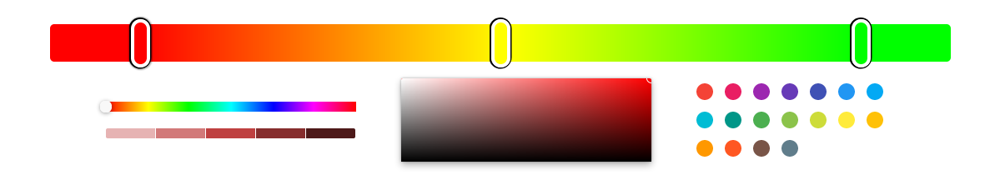

[](https://opensource.org/licenses/MIT)


[](https://app.netlify.com/sites/react-gradient-hook/deploys)


<div align="center">
    <h2>react-gradient-hook</h2>
  <p align="center">
    
  </p>
</div>
<br />
<div>
  <h3 align="center">
    A react gradient hook for users to create custom gradients.  
  </h3>
  <ul style='margin-top: 10px'>
    <li><b>Typescript</b> support</li>
    <li><b>Hook</b> and standalone <b>Component</b> available</li>
  </ul>
</div>

<div>
  <p align="center">
    <a href="https://react-gradient-hook.netlify.app" target="_blank">
    Live playground here 🎨
    </a>
  </p>
</div>

# Examples
 - As a hook
```ts
const Component = (props) => {
  const [colors, gradient] = useGradient({options})
  ...
  return (
    { gradient }
  )
}
```

 - As a Component


 - `defaultColors` (optional, type: `TRGB[]`): Array of default colors for the gradient
```ts
type TRGB = {
  r: number, 
  g: number, 
  b: number, 
  t: number
}
```

- `onChange` (optional): function triggered when the gradient changes (different colors, a cursor is moved, ...)
```ts
onChange: (colors: TRGB[]) => void;
```

- `gradientOptions` (optional): Options to change the way the gradient is displayed
  - `height` (optional, type: number, default: 45): Control the gradients height in pixels

- `cursorOptions` (optional): Options to control the behavior of the cursors (i.e. colors on the gradient)
  - `width` (optional, type: number, default: 15)
  - `border` (optional, type: number, default: 4)
  - `shadow` (optional, type: number, default: 2)
  - `scale` (optional, type: number, default: 5)
  - `grid` (optional, type: boolean, default: false)
  - `samples` (optional, type: number, default: 0): Number of steps the cursors can take. <b>Only works</b> if `grid` is set to `true`

- `pickerOptions` (optional): Options to control the color pickers under the gradient
  -  `showHue` (optional, type: boolean, default: true)
  -  `showChrome` (optional, type: boolean, default: true)
  -  `showCircles` (optional, type: boolean, default: true)
